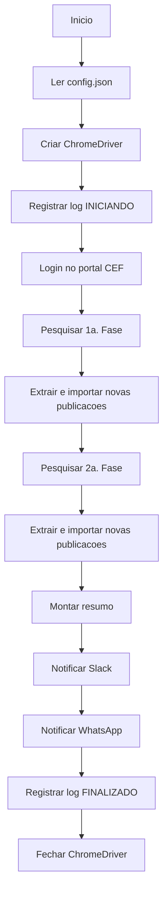

# ROBO-CEF

Aplicacao console .NET para automatizar consulta de publicacoes no portal juridico da Caixa, importar novas publicacoes para MySQL e enviar resumo de processamento por Slack e WhatsApp.

Esta documentacao foi atualizada com base na engenharia reversa do codigo-fonte existente no repositorio. Nao foram assumidas regras fora do que esta implementado no projeto.

## Visao geral

O fluxo principal esta em `Robo-CEF/Program.cs` e executa:

1. Le configuracoes de `config.json`.
2. Abre Chrome via Selenium WebDriver.
3. Realiza login no portal juridico CEF com usuario, senha e captcha.
4. Pesquisa publicacoes por periodo.
5. Processa primeiro grau e segundo grau.
6. Extrai tabelas HTML do portal.
7. Remove duplicidades por expediente.
8. Consulta expedientes ja existentes no banco.
9. Importa novas publicacoes via stored procedure.
10. Registra logs de execucao.
11. Envia resumo por Slack e WhatsApp.
12. Fecha o driver do browser.

## Stack

| Item | Tecnologia |
|---|---|
| Linguagem | C# |
| Runtime | .NET 8 |
| Tipo de aplicacao | Console |
| Automacao web | Selenium WebDriver + ChromeDriver |
| Banco de dados | MySQL |
| Acesso a dados | Dapper + MySql.Data |
| Configuracao | `Microsoft.Extensions.Configuration.Json` |
| Captcha | CapMonster Cloud |
| Notificacoes | Slack webhook e procedure WhatsApp |

## Estrutura do projeto

```text
.
├── Robo-CEF.sln
├── README.md
├── AGENTS.md
├── prompts/
│   └── reverse-engineering.md
├── outputs/
│   └── engenharia-reversa/
└── Robo-CEF/
    ├── Program.cs
    ├── Robo-CEF.csproj
    ├── config.json
    ├── Constants/
    ├── Models/
    ├── MySqlDatabase/
    ├── Repositories/
    ├── Services/
    ├── Utils/
    └── Workers/
```

## Modulos principais

| Modulo | Arquivos principais | Responsabilidade |
|---|---|---|
| Orquestracao | `Robo-CEF/Program.cs` | Inicializacao, fluxo geral, resumo e encerramento |
| Login | `Robo-CEF/Services/LoginService.cs` | Autenticacao no portal CEF |
| Captcha | `Robo-CEF/Services/CapchaService.cs` | Resolucao de captcha via CapMonster |
| Publicacoes | `Robo-CEF/Services/PublicacoesService.cs` | Consulta, filtros, paginacao e extracao de tabelas |
| Parser HTML | `Robo-CEF/Utils/HtmlTableParser.cs` | Conversao de tabela HTML para objetos |
| Persistencia | `Robo-CEF/Repositories/*.cs` | Consultas, procedures e logs no MySQL |
| Notificacoes | `Robo-CEF/Services/NotityService.cs` | Envio de resumo para Slack e WhatsApp |

## Configuracao

O projeto usa `Robo-CEF/config.json` como fonte de configuracao. Os valores sensiveis nao devem ser versionados em claro.

Chaves usadas pelo codigo:

| Chave | Uso |
|---|---|
| `ConnectionStrings:DefaultConnection` | Conexao MySQL |
| `LoginUser:UserName` | Usuario do portal CEF |
| `LoginUser:PassWord` | Senha do portal CEF |
| `Capmonster:Key` | Chave CapMonster |
| `TimeoutSeconds:Default` | Timeout Selenium padrao |
| `TimeoutSeconds:Loading` | Timeout para carregamentos |
| `ItemsPerPage` | Quantidade de itens por pagina no portal |
| `DiasRetroativos` | Quantidade de dias retroativos pesquisados |
| `IsDevelopment` | Controla janela maximizada ou tamanho fixo do Chrome |

Nao foram encontradas leituras de variaveis de ambiente no codigo atual.

## Como executar

Pre-requisitos esperados:

- .NET SDK 8 instalado.
- Google Chrome compativel com o ChromeDriver declarado no projeto.
- Acesso ao portal juridico CEF.
- Acesso ao banco MySQL configurado.
- Chave valida do CapMonster.
- Webhook Slack/procedure WhatsApp disponiveis, caso as notificacoes devam funcionar.

Restaurar/compilar:

```powershell
dotnet build Robo-CEF.sln
```

Executar:

```powershell
dotnet run --project Robo-CEF/Robo-CEF.csproj
```

Publicar em Release, conforme configuracao do `.csproj`:

```powershell
dotnet publish Robo-CEF/Robo-CEF.csproj -c Release
```

Observacao da engenharia reversa: o build nao foi validado neste ambiente porque o .NET SDK nao estava instalado.

## Fluxo operacional



## Integracoes externas

| Integracao | Uso | Evidencia |
|---|---|---|
| Portal juridico CEF | Login, filtros e extracao de publicacoes | `LoginService.cs`, `PublicacoesService.cs` |
| CapMonster Cloud | Resolucao de captcha | `CapchaService.cs` |
| Slack webhook | Envio do resumo final | `NotityService.cs` |
| MySQL | Consulta/importacao/logs/notificacao WhatsApp | `Repositories/*.cs` |

## Banco de dados

Objetos identificados por uso no codigo:

| Objeto | Tipo | Uso |
|---|---|---|
| `EPM_ROCHA.T_PROCESSOS_TERCEIRIZACAO_CEF` | Tabela | Consulta de expedientes existentes |
| `EPM_ROCHA.T_EXECUCOES_ROBOTS` | Tabela | Logs de execucao |
| `EPM_ROCHA.PRC_PUBLICACOES_PORTAL_CEF_MER_760` | Stored procedure | Importacao de publicacoes |
| `EPM_ROCHA.PRC_NOTIFICA_SUPORTE_ROCHA_ZAP` | Stored procedure | Envio de mensagem WhatsApp |

Nao ha migrations, DDL ou schema completo no repositorio.

## Pontos de atencao

- O arquivo `Robo-CEF/config.json` contem configuracoes sensiveis no projeto original.
- O webhook Slack esta hardcoded em `Robo-CEF/Services/NotityService.cs`.
- O projeto referencia `HtmlAgilityPack` e `Newtonsoft.Json` no codigo, mas esses pacotes nao aparecem declarados no `.csproj`.
- A automacao depende da estrutura HTML e dos seletores do portal externo.
- Nao foram encontrados testes automatizados.
- A pasta `Robo-CEF/Workers` contem implementacoes alternativas/legadas que nao sao chamadas pelo `Main` atual.

## Documentacao tecnica completa

A engenharia reversa completa esta em:

- [Indice da engenharia reversa](docs/robo-cef-README.md)
- [Visao geral](docs/robo-cef-engenharia-reversa.md)
- [Mapa de rotas e telas](docs/robo-cef-telas.md)
- [Modulos funcionais](docs/robo-cef-modulos-funcionais.md)
- [APIs, servicos e integracoes](docs/robo-cef-api.md)
- [Catalogo de dados, formularios e banco](docs/robo-cef-banco.md)
- [Regras de negocio](docs/robo-cef-regras-negocio.md)
- [Cenarios de teste QA](docs/robo-cef-qa.md)
- [Arquitetura tecnica](docs/robo-cef-arquitetura.md)
- [Riscos e dividas tecnicas](docs/robo-cef-riscos.md)
- [Pontos a validar](docs/robo-cef-pontos-a-validar.md)
- [Inventario do codigo-fonte](docs/robo-cef-inventario-codigo-fonte.md)
- [Fluxo operacional detalhado](docs/robo-cef-fluxo-operacional.md)
- [Matriz de rastreabilidade](docs/robo-cef-matriz-rastreabilidade.md)
