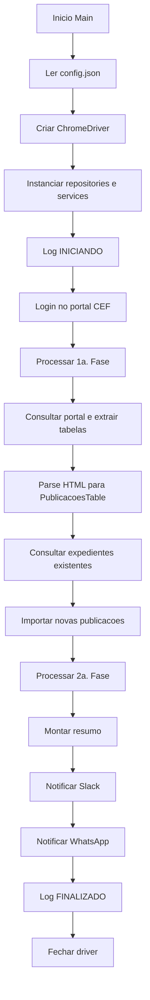

# 08 - Arquitetura Tecnica

## Estilo arquitetural

A aplicacao segue um fluxo procedural/orquestrado por console, com separacao simples por pastas:

- `Program.cs`: composicao manual e orquestracao.
- `Services`: regras de automacao e integracoes.
- `Repositories`: persistencia e procedures.
- `Models`: dados trafegados entre parser, importacao e resumo.
- `Constants`: valores fixos.
- `Utils`: parsing HTML.
- `Workers`: implementacoes alternativas/legadas.

Nao ha injecao de dependencia formal, web server, controllers, jobs agendados no codigo ou camada de dominio isolada.

## Fluxo principal

1. `Main` le configuracao.
2. `DriverBuilder` cria `ChromeDriver`.
3. Instancia repositories: `WhatsAppRepository`, `LogsRepository`, `PublicacoesRepository`.
4. Instancia services: `CaptchaService`, `LoginService`, `PublicacoesService`, `NotifyService`.
5. Registra inicializacao.
6. Executa login.
7. Processa primeiro grau.
8. Processa segundo grau.
9. Envia resumo por Slack e WhatsApp.
10. Registra finalizacao.
11. Fecha driver.

## Diagrama de fluxo

## Fluxo de dados

| Origem | Transformacao | Destino |
|---|---|---|
| `config.json` | `ConfigurationBuilder` | Parametros de login, banco, captcha, timeouts e periodo |
| Portal CEF | Selenium preenche filtros e coleta `outerHTML` | Lista de tabelas HTML |
| Tabelas HTML | `HtmlTableParser.Parse<PublicacoesTable>` | Lista de `PublicacoesTable` |
| Lista extraida | Dedupe por `p_EXPEDIENTE` e consulta de existentes | Lista de novas publicacoes |
| Novas publicacoes | Stored procedure de importacao | Banco MySQL |
| Contadores de execucao | Texto formatado | Console, Slack e WhatsApp |

## Acoplamentos

| Acoplamento | Evidencia | Risco |
|---|---|---|
| Selenium direto nos servicos | `IWebDriver` usado em `LoginService` e `PublicacoesService` | Dificulta teste unitario |
| Configuracao lida diretamente | `IConfiguration` nos servicos e `config.json` em workers | Segredos e dependencias em runtime |
| Banco direto por repository | `MySqlConnection` em cada metodo | Sem pool/config central explicita |
| Webhook hardcoded | `NotifyService.cs` | Exposicao de segredo e pouca flexibilidade |
| Portal externo por seletores | IDs/CSS/XPath no codigo | Quebra se HTML externo mudar |

## Tratamento de estado

Nao ha store/contexto. O estado da execucao e mantido em variaveis locais no `Main` e em `ResumoExtracao`.

## Tratamento de erro

- Login captura falhas por tentativa e retorna `false`; apos tres tentativas lanca `InvalidOperationException`.
- Captcha lanca excecao se CapMonster retorna erro.
- Consulta do total retorna `0` em falhas ao localizar/parsear caption.
- Selecao de itens por pagina registra aviso e continua.
- Importacao captura erro por item e continua.
- Erro global no `Main` define exit code 1, inclui mensagem no resumo e relanca.

## Build e publicacao

`Robo-CEF.csproj` define publicacao Release como single-file, self-contained, `win-x64`, com compressao.

Nao foi possivel executar build local por ausencia de .NET SDK.
