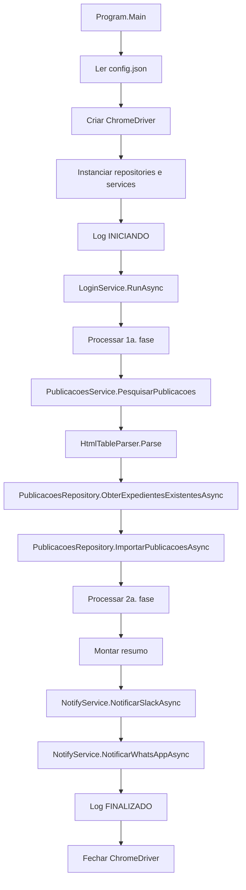

# Arquitetura Tecnica

Fonte principal: `outputs/relatorios/inventario-projeto.md`.

## Estilo arquitetural

O projeto e uma aplicacao console .NET 8 com orquestracao procedural em `Program.cs`.

Caracteristicas identificadas:

- composicao manual de dependencias;
- automacao web com Selenium WebDriver e ChromeDriver;
- acesso a banco MySQL com Dapper e MySql.Data;
- resolucao de captcha com CapMonster;
- notificacoes por Slack webhook e procedure WhatsApp;
- parser HTML para transformar tabelas em objetos.

Evidencias: `Robo-CEF/Program.cs`, `Robo-CEF/Robo-CEF.csproj`, `outputs/relatorios/inventario-projeto.md`.

## Camadas e responsabilidades

| Camada/pasta | Responsabilidade | Evidencia |
|---|---|---|
| `Program.cs` | Entrada, composicao e orquestracao | `Robo-CEF/Program.cs` |
| `Services` | Login, captcha, consulta de publicacoes e notificacoes | `Robo-CEF/Services/*.cs` |
| `Repositories` | Persistencia, procedures e logs | `Robo-CEF/Repositories/*.cs` |
| `Models` | Objetos de publicacao, resumo e credenciais | `Robo-CEF/Models/*.cs` |
| `Constants` | Formatos, fases e status | `Robo-CEF/Constants/*.cs` |
| `Utils` | Conversao de tabela HTML | `Robo-CEF/Utils/HtmlTableParser.cs` |
| `Workers` | Implementacoes alternativas/legadas nao chamadas pelo `Main` atual | `Robo-CEF/Workers/*.cs` |
| `crawler-interface` | Coleta auxiliar de evidencias Blunana e engenharia reversa operacional | `crawler-interface/**/*.ts` |
| `index` | Indice mestre para orientar consulta de fontes antes de varrer arquivos | `index/master-index.json` |
| `external-agent` | Estrutura dedicada ao futuro Assistente IA CEF, incluindo executor inicial, configuracao de fontes e busca local em Markdown/JSON | `external-agent/README.md`, `external-agent/index.ts`, `external-agent/config/paths.ts`, `external-agent/core/search.ts` |

## Direcao arquitetural: Assistente IA CEF

O projeto passa a reservar `external-agent/` para o Assistente IA CEF. Essa camada deve evoluir como modulo separado do crawler, consumindo primeiro `index/master-index.json` e, a partir dele, documentacao, knowledge, tickets, outputs e engenharia reversa como contexto.

O crawler TypeScript continua existindo como fonte auxiliar de evidencias e inventarios, mas nao deve ser tratado como centro da arquitetura final.

Evidencias: `index/master-index.json`, `external-agent/README.md`, `external-agent/index.ts`, `external-agent/config/paths.ts`, `external-agent/core/search.ts`, `crawler-interface/**/*.ts`.

## Fluxo tecnico principal

Evidencia: `Robo-CEF/Program.cs`.

## Integracoes tecnicas

| Integracao | Tecnologia | Evidencia |
|---|---|---|
| Portal juridico CEF | Selenium WebDriver | `Robo-CEF/Services/LoginService.cs`, `Robo-CEF/Services/PublicacoesService.cs` |
| Captcha | `Zennolab.CapMonsterCloud.Client` | `Robo-CEF/Services/CapchaService.cs`, `Robo-CEF/Robo-CEF.csproj` |
| Banco | MySQL, Dapper, MySql.Data | `Robo-CEF/Repositories/*.cs`, `Robo-CEF/Robo-CEF.csproj` |
| Slack | `HttpClient` com webhook | `Robo-CEF/Services/NotityService.cs` |
| WhatsApp | Stored procedure no MySQL | `Robo-CEF/Repositories/WhatsAppRepository.cs` |

## Pontos tecnicos a validar

| Ponto | Motivo | Evidencia |
|---|---|---|
| Dependencias `HtmlAgilityPack` e `Newtonsoft.Json` | Inventario indica uso no codigo, mas nao aparecem no `.csproj` lido | `outputs/relatorios/inventario-projeto.md` |
| Workers legados | Existem no projeto, mas nao sao chamados pelo fluxo ativo | `Robo-CEF/Workers/*.cs`, `Robo-CEF/Program.cs` |
| Schema do banco | Nao ha DDL ou migrations no repositorio | `outputs/relatorios/inventario-projeto.md` |
| Implementacao funcional do Assistente IA CEF | Existe estrutura inicial, mas sem providers, tools ou servicos implementados | `external-agent/README.md`, `external-agent/index.ts` |
